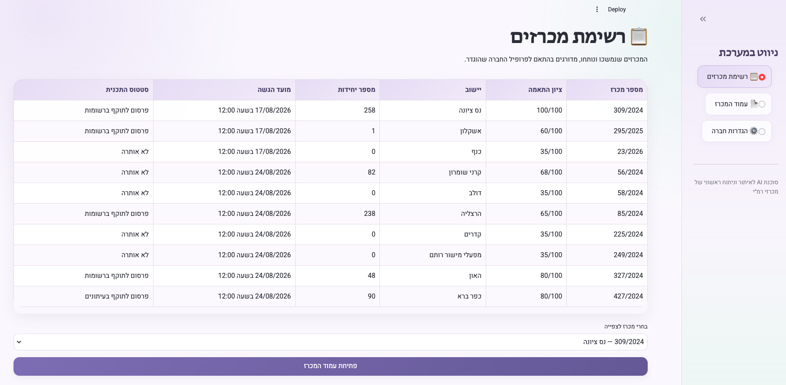
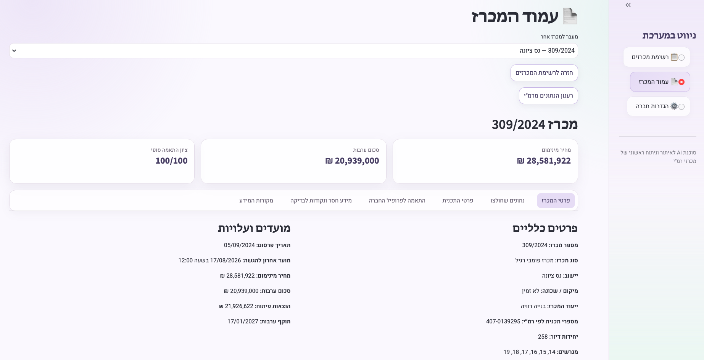
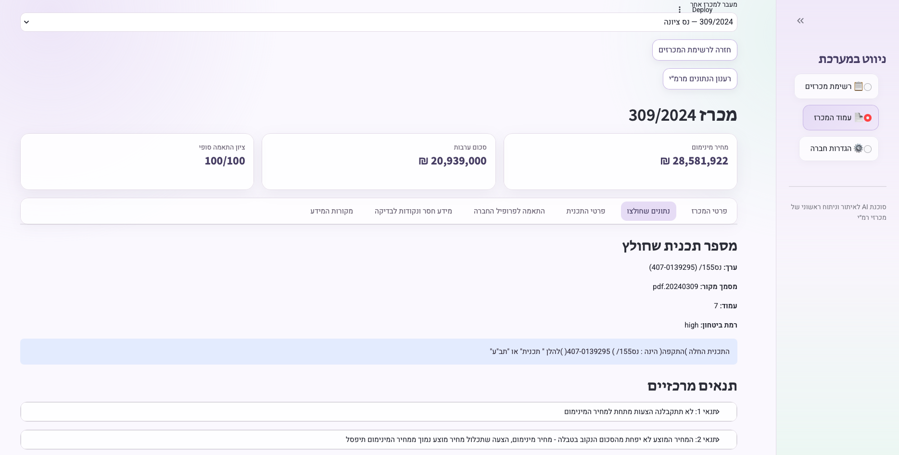
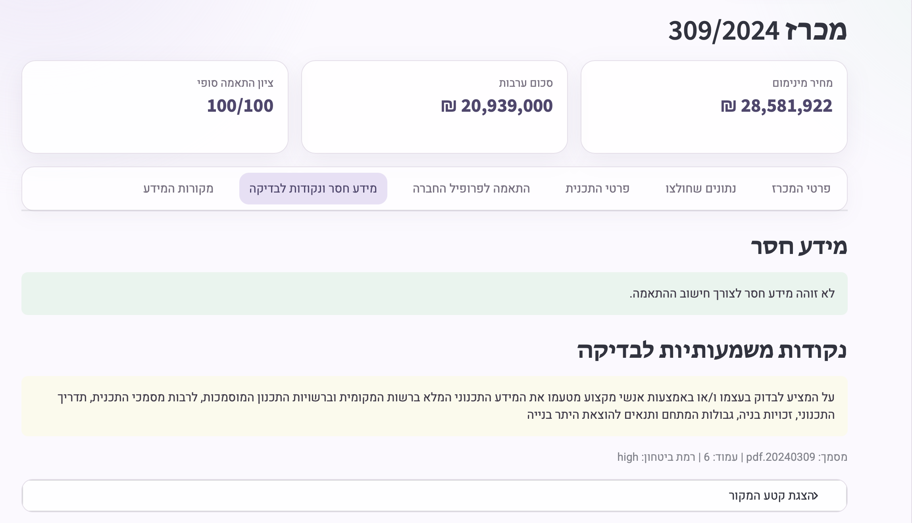
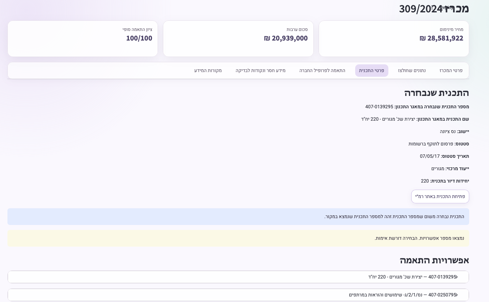
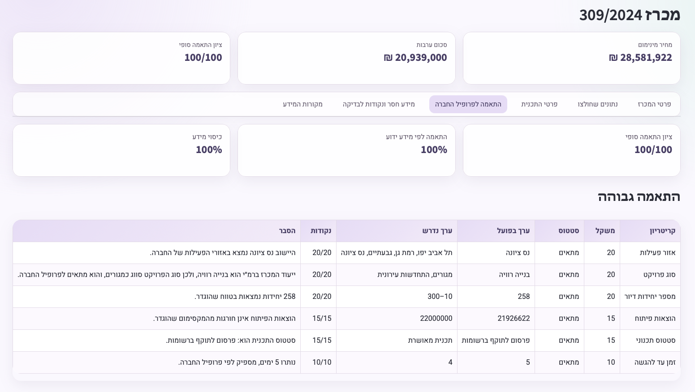
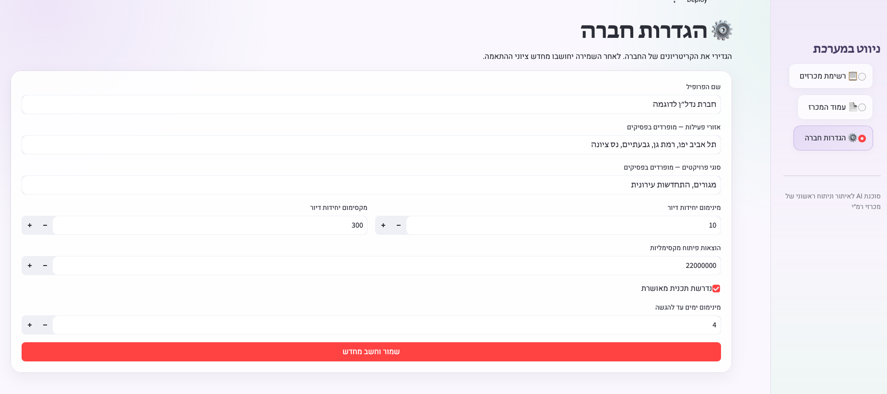
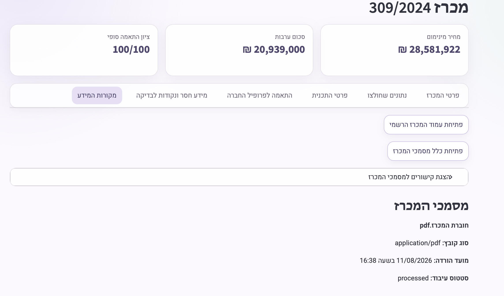

# הדגמת המערכת

מסמך זה מדגים את פעולת הסוכנת מקצה לקצה על נתונים אמיתיים שנמשכו מרשות מקרקעי ישראל, ואת כיסוי דרישות המטלה באמצעות נתוני API מובנים, חילוץ ממוקד מחוברת המכרז, מידע תכנוני והתאמה לפרופיל חברה.

> **הערת snapshot:** ההדגמה מבוססת על מאגר הניתוח הסופי כפי שנשמר ב-11/08/2026. מכרזים, מועדי הגשה ומסמכים הם מידע חי שעשוי להשתנות לאחר מועד זה.

**Live demo:** [פתיחת המערכת ב-Streamlit](https://rmi-tender-agent.streamlit.app)

---

## 1. עשרה מכרזים שנמשכו ונותחו אוטומטית

המאגר הסופי כולל 10 רשומות ניתוח שנוצרו עבור מכרזים שונים, ולא תנאים שמקודדים עבור מכרז יחיד:

```text
20240056.json  20240058.json  20240085.json  20240225.json  20240249.json
20240309.json  20240327.json  20240427.json  20250295.json  20260023.json
```

הצינור מושך נתוני מכרז מובנים, מנסה לאתר ולעבד חוברת, מחפש מידע תכנוני ומחשב התאמה לפרופיל החברה. לא לכל מכרז קיימת חוברת ולא בכל רשומה בוצע חילוץ AI מוצלח; סטטוס כל מקור נשמר במפורש. מספר יחידות הדיור מגיע מ-`YechidotDiur` בנתוני רמ״י ואינו מחולץ באמצעות AI.

הרשימה בממשק מציגה את 10 הרשומות עם מספר המכרז, יישוב, מספר יחידות דיור, מועד הגשה, סטטוס תכנית וציון התאמה:



---

## 2. דוגמה מלאה — מכרז 309/2024, נס ציונה

מכרז 309/2024 (`michraz_id = 20240309`) מדגים את הזרימה המלאה: נתוני רמ״י, חוברת שעובדה בהצלחה, תכנית שנבחרה ומנגנון התאמה שחושב.

### שדות המכרז המובנים מרמ״י

<table dir="rtl">
  <thead>
    <tr><th>שדה</th><th>ערך שמור</th></tr>
  </thead>
  <tbody>
    <tr><td>מספר מכרז</td><td>309/2024</td></tr>
    <tr><td>סוג מכרז</td><td>מכרז פומבי רגיל</td></tr>
    <tr><td>ייעוד מכרז</td><td>בנייה רוויה</td></tr>
    <tr><td>קטגוריית ייעוד רשמית</td><td>מגורים</td></tr>
    <tr><td>יישוב</td><td>נס ציונה</td></tr>
    <tr><td>תאריך פרסום</td><td>05/09/2024</td></tr>
    <tr><td>מועד אחרון להגשה</td><td>17/08/2026 בשעה 12:00</td></tr>
    <tr><td>מגרשים</td><td>14, 15, 16, 17, 18, 19</td></tr>
    <tr><td>גוש וחלקה</td><td>גוש 3751, חלקות 163–168</td></tr>
    <tr><td>מספר תכנית לפי רמ״י</td><td>407-0139295</td></tr>
    <tr><td>יחידות דיור</td><td>258</td></tr>
    <tr><td>מחיר מינימום</td><td>28,581,922 ₪</td></tr>
    <tr><td>הוצאות פיתוח</td><td>21,926,622 ₪</td></tr>
    <tr><td>סכום ערבות</td><td>20,939,000 ₪</td></tr>
  </tbody>
</table>

לא נמצא ב-payload הרשמי שדה נפרד לשם תיאורי של המכרז, ולכן לא מוצג כאן שם מומצא.



---

## 3. חילוץ מידע מחוברת המכרז באמצעות AI

החילוץ הממוקד מחוברת `20240309.pdf` נשמר בארבעה שדות:

- `plan_number` — הערך `נס155/ (407-0139295)`, עמוד 7, ביטחון `high`. הציטוט השמור מתחיל ב-"התכנית החלה ... נס155/ ... 407-0139295".
- `land_designation` — הערך `בנייה רוויה למגורים`, עמוד 7, ביטחון `high`, עם הציטוט: "ייעוד המגרשים הוא: בנייה רוויה למגורים."
- `threshold_conditions` — שמונה תנאים נפרדים. בין היתר נשמרו איסור הצעה מתחת למחיר המינימום, הגשת הצעה אחת בלבד, ערבות בסך 20,939,000 ₪, טופס אישור הצעה חתום והמועד האחרון להגשה.
- `point_to_check` — חובה לבדוק באמצעות אנשי מקצוע את המידע התכנוני המלא, זכויות הבנייה, הגבולות והתנאים להיתר; מקור `20240309.pdf`, עמוד 6, ביטחון `high`.

לכל נתון נשמרים `source_document`, `page`, `excerpt` ו-`confidence`. המודל מונחה להחזיר `null` וביטחון נמוך כאשר אין בחוברת טענה מפורשת, ולא להשלים מידע מסוג המכרז, מהיישוב או ממקור אחר. `land_designation` נשמר ב-JSON כאשר החוברת תומכת בו במפורש, אך אין לו כיום שורת UI ייעודית.





---

## 4. איתור התכנית במאגר התכנון

לוגיקת האיתור כללית ומשלבת שלושה סוגי ראיות זמינים:

1. הפניות תכנית מובנות מרמ״י שהן שימושיות לחיפוש.
2. מספר תכנית שימושי שחולץ מהחוברת, בלי למחוק את ראיות רמ״י.
3. חיפושי גוש וחלקה כאשר קיימים נתונים קדסטריים.

הפניה ריקה או כללית שאינה מכילה ספרה, למשל `תמל`, אינה נשלחת לחיפוש. תוצאות החיפושים מאוחדות ומנוכות מכפילויות, וכל מועמדת מקבלת ציון וסיבות התאמה. בחירה אוטומטית נעשית רק כאשר המועמדת המובילה חיובית ויחידה; תיקו בציון הגבוה אינו מוכרע לפי סדר התוצאות של ה-API.

### מה קרה במכרז 309/2024

- ראיית רמ״י: `407-0139295` — החיפוש החזיר תוצאה אחת.
- ראיית החוברת: `נס155/ (407-0139295)` — נשמרה ונשלחה לחיפוש, שהחזיר 0 תוצאות בפורמט זה.
- בוצעו שישה חיפושי גוש/חלקה עבור גוש 3751 וחלקות 163–168.
- לאחר איחוד כפילויות נשמרו תשע מועמדות.
- התכנית `407-0139295` קיבלה ציון 100 משום שמספרה זהה למספר תכנית שנמצא במקור; שמונה המועמדות האחרות קיבלו 0.

התכנית שנבחרה היא `407-0139295`, "יצירת שכ' מגורים - 220 יח״ד", בנס ציונה. הסטטוס הוא "פרסום לתוקף ברשומות", הייעוד המרכזי הוא מגורים ובפרטי התכנית נשמרו 220 יחידות דיור. סיבת הבחירה השמורה היא התאמה מדויקת למספר תכנית ידוע. מאחר שנשמרו כמה מועמדות, הרשומה עדיין מסומנת לבדיקת משתמש, אף שקיימת מובילה יחידה וברורה.



---

## 5. התאמה לפרופיל החברה

תוצאת ההתאמה השמורה עבור 309/2024 היא:

- **ציון סופי (`score`):** 100
- **ציון לפי מידע ידוע (`known_match_score`):** 100
- **כיסוי מידע (`data_coverage`):** 100%
- **המלצה:** התאמה גבוהה

<table dir="rtl">
  <thead>
    <tr><th>קריטריון</th><th>בפועל</th><th>נדרש</th><th>סטטוס</th><th>נקודות</th><th>הסבר</th></tr>
  </thead>
  <tbody>
    <tr><td>אזור פעילות</td><td>נס ציונה</td><td>תל אביב יפו, רמת גן, גבעתיים, נס ציונה</td><td>מתאים</td><td>20/20</td><td>היישוב נס ציונה נמצא באזורי הפעילות של החברה.</td></tr>
    <tr><td>סוג פרויקט</td><td>בנייה רוויה</td><td>מגורים, התחדשות עירונית</td><td>מתאים</td><td>20/20</td><td>ייעוד המכרז ברמ״י הוא בנייה רוויה, ולכן סוג הפרויקט סווג כמגורים, והוא מתאים לפרופיל החברה.</td></tr>
    <tr><td>מספר יחידות דיור</td><td>258</td><td>10–300</td><td>מתאים</td><td>20/20</td><td>258 יחידות נמצאות בטווח שהוגדר.</td></tr>
    <tr><td>הוצאות פיתוח</td><td>21,926,622 ₪</td><td>עד 22,000,000 ₪</td><td>מתאים</td><td>15/15</td><td>הוצאות הפיתוח אינן חורגות מהמקסימום שהוגדר.</td></tr>
    <tr><td>סטטוס תכנוני</td><td>פרסום לתוקף ברשומות</td><td>תכנית מאושרת</td><td>מתאים</td><td>15/15</td><td>סטטוס התכנית הוא: פרסום לתוקף ברשומות.</td></tr>
    <tr><td>זמן עד להגשה</td><td>5 ימים בעת החישוב</td><td>לפחות 4 ימים</td><td>מתאים</td><td>10/10</td><td>נותרו 5 ימים, מספיק לפי פרופיל החברה.</td></tr>
  </tbody>
</table>

המנוע תומך בארבעה סטטוסים: `matched`, `not_matched`, `needs_clarification` ו-`not_applicable`. קריטריון שדורש בירור נשאר ישים ומקבל קרדיט חלקי של 20% ממשקלו בציון הסופי. קריטריון שאינו רלוונטי אינו נכלל במכנים של הציון, `known_match_score` או `data_coverage`. אפס מספרי הוא ערך ידוע ואינו הופך אוטומטית למידע חסר.



---

## 6. פרופיל החברה

פרופיל החברה ניתן לעריכה בממשק וכולל אזורי פעילות, סוגי פרויקטים, טווח יחידות דיור, תקרת הוצאות פיתוח, דרישה לתכנית מאושרת ומספר ימים מינימלי עד להגשה. בפרופיל של ה-snapshot הוגדרו בין היתר נס ציונה כאזור פעילות, 10–300 יחידות, תקרת פיתוח של 22,000,000 ₪ ומינימום 4 ימים להגשה.

שמירת הפרופיל מאמתת את הערכים ומפעילה חישוב מחדש של ההתאמה לכל רשומות המכרזים.



---

## 7. מקורות וקישורים רשמיים

לכל מכרז נשמר קישור לעמוד הרשמי ב-MichrazimSite וקישור לעמוד כלל מסמכי המכרז. בנוסף נשמרת רשימת מסמכים מובנית עם שם, תפקיד ו-`source_url`, והממשק מציג קישורים לחיצים למסמכים הזמינים.

במכרז 309/2024 חוברת המכרז נמצאה ועובדה בהצלחה (`processing_status: processed`). לצד החוברת זמינים מסמך הפרסום המלא, עדכונים, תשריט ומסמכים מצורפים נוספים.



---

## מגבלות ביחס לדרישות המטלה

- לא נמצא בנתוני רמ״י שנבדקו שדה רשמי נפרד ל"שם מכרז" תיאורי, ולכן המערכת אינה ממציאה או מציגה שם חלופי.
- `land_designation` מחולץ ונשמר עם provenance, אך עדיין אין לו שורת תצוגה ייעודית בממשק.
- כיסוי TabaSearch והבדלי פורמט במספרי תכנית עלולים למנוע איתור אוטומטי גם כאשר קיימת הפניה ידועה; במצב כזה המערכת מציגה את הראיות ואינה ממציאה בחירה.

---

## אתגרים מרכזיים ואופן ההתמודדות

### 1. פתרון קודים של רמ״י לערכים קריאים

פרטי המכרז כוללים קודים כגון `KodYeshuv`, `KodSugMichraz` ו-`KodYeudMichraz`. המערכת בונה מילוני lookup מ-`YeshuvimApi` ומ-`GeneralTablesApi`, שומרת את הקודים הגולמיים ומוסיפה את הערכים הקריאים. קבוצת ייעוד המכרז נשמרת מאותה שורת `TableID = -1` ומשמשת להחלטות התאמה כלליות.

### 2. חילוץ AI אמין עם provenance

חוברות המכרז ארוכות ומכילות מספרי תכנית, גוש, חלקה, מגרש, סעיף וסכומים שקל לבלבל ביניהם. ההנחיה ב-`extract.py` מגבילה את הפלט לארבעה שדות, דורשת ערך, מסמך, עמוד, ציטוט ורמת ביטחון, ומחזירה `null` במקום לנחש. ייעוד קרקע מתקבל רק כאשר הוא נאמר במפורש בחוברת.

### 3. הפניות תכנית כלליות ועמימות בין מועמדות

הפניות גולמיות נשמרות לצורך provenance, אך רק ערך שמכיל ספרה משמש לחיפוש אוטומטי. המערכת משלבת ראיות רמ״י, חוברת וגוש/חלקה, מסירה כפילויות ומדרגת עם סיבות. כאשר אין מובילה חיובית יחידה, היא משאירה את הבחירה לאימות אנושי במקום לבחור את תוצאת ה-API הראשונה.
